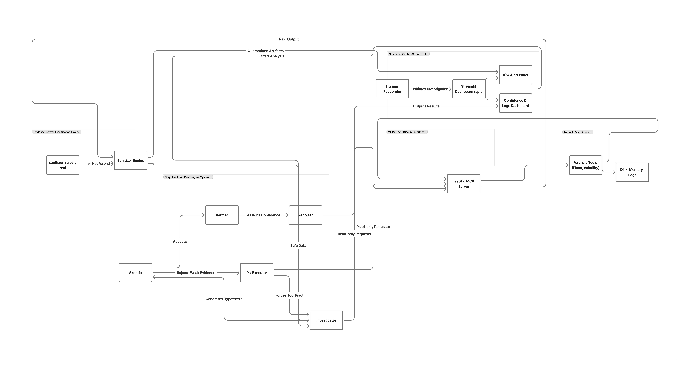

# SIFT-Guardian

SIFT-Guardian is a hackathon-ready prototype for a self-correcting autonomous DFIR agent.
It simulates senior responder behavior through skeptical review, strategy pivots, contradiction checks, and confidence tracking.

## Features

- FastAPI MCP server with read-only forensic endpoints:
  - `/get_process_list`
  - `/extract_timeline`
  - `/get_login_events`
- Multi-agent architecture:
  - `Investigator`
  - `Skeptic`
  - `Re-Executor`
  - `Verifier`
  - `Reporter`
- Self-correction loop with:
  - max iteration guard
  - anti-loop strategy pivoting
  - low-confidence graceful failure mode
- Cognitive guardrails:
  - no conclusion with fewer than two evidence sources
  - unsupported claim rejection
  - contradiction detection (timeline vs memory/disk consistency checks)
- Structured logging and printable logs
- EvidenceFirewall sanitizer rules in external `sanitizer_rules.yaml` with hot reload on file change
- Streamlit dashboard:
  - run button
  - final JSON output
  - confidence chart
  - scrollable log viewer
  - quarantined artifact IOC panel
  - sanitization decision stream

## Architecture Diagram
  

## Documentation

- [Dataset Documentation](docs/dataset.md)
- [Accuracy Report](docs/accuracy_report.md)
- [Try It Out](docs/try_it_out.md)

## Project Structure

```
sift_guardian/
├── app.py
├── mcp_server.py
├── main.py
├── agents.py
├── state.py
├── utils.py
├── sanitizer.py
├── mock_data.json
├── sanitizer_rules.yaml
├── requirements.txt
├── docs/
│   ├── dataset.md
│   ├── accuracy_report.md
│   └── try_it_out.md
└── README.md
```

## Setup

1. Create and activate a virtual environment.
2. Install dependencies:

```bash
pip install -r requirements.txt
```

For a full local walkthrough (API + CLI + dashboard), see [Try It Out](docs/try_it_out.md).

## Run MCP Server

```bash
uvicorn mcp_server:app --reload --port 8000
```

API docs are available at `http://127.0.0.1:8000/docs`.

## Run CLI Investigation

```bash
python main.py
```

This prints the final structured response and includes:
- finding
- confidence score
- confidence history
- evidence list
- contradictions
- iterations required

## Run Streamlit Dashboard

```bash
streamlit run app.py
```

Click **Run Investigation** to execute the full self-correcting incident response workflow.

## Tuning Sanitizer Rules Live

`sanitizer_rules.yaml` is loaded dynamically by the EvidenceFirewall.
You can modify patterns/thresholds and click **Run Investigation** again to apply new rules without changing Python code.

## Demo Behavior

The included mock dataset demonstrates:

1. Initial incomplete finding from process-only evidence
2. Skeptic rejection due to weak evidence base
3. Re-executor strategy pivot to alternate data source
4. Improved cross-source evidence correlation
5. Rising confidence and final verified result

Detailed dataset description is available in [Dataset Documentation](docs/dataset.md), and current validation status is tracked in the [Accuracy Report](docs/accuracy_report.md).

## Real SIFT Tool Integration (Process + Timeline)

`get_process_list` and `extract_timeline` can now consume real tool exports instead of mock data.

1. Export process data from a SIFT-compatible tool (example: Volatility `windows.pslist`) as JSON, NDJSON, or CSV.
2. Export timeline data from your timeline pipeline (example: Plaso/Log2Timeline) as JSON, NDJSON, or CSV.
3. Save files to one of:
   - `sift_guardian/real_tool_output/process_list.json` (default lookup)
   - `sift_guardian/real_tool_output/timeline.json` (default lookup)
   - any custom path via `SIFT_PROCESS_LIST_PATH`
   - any custom path via `SIFT_TIMELINE_PATH`
4. Run CLI (`python main.py`) or API (`uvicorn mcp_server:app --reload --port 8000`).

If an export is missing or invalid, the system falls back to `mock_data.json` automatically.

## 🔍 Evidence Traceability

Every finding includes:
- source tool
- raw data reference
- traceable execution logs

This ensures zero hallucinated outputs and full auditability.